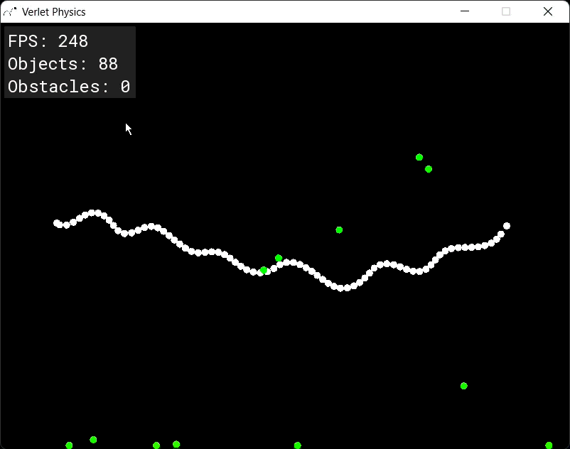
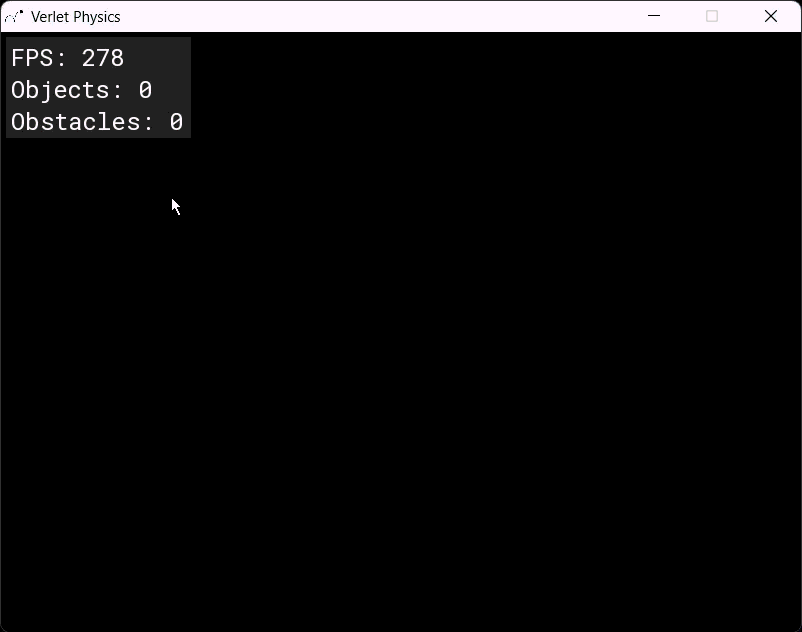
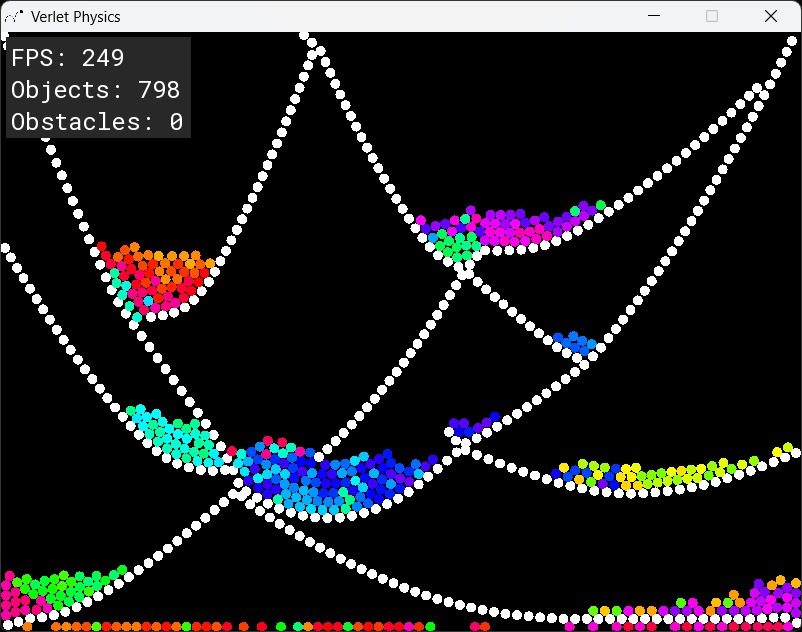
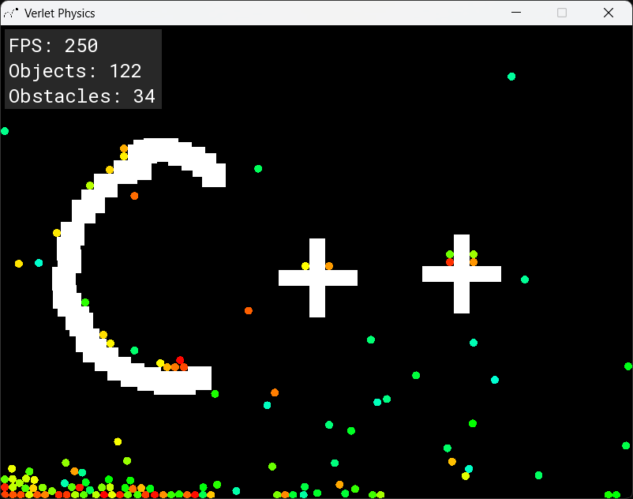

# Verlet Physics
A simple Verlet physics engine written in C++ using SFML.

## Features
- Objects and obstacles
    - Rainbow bouncy balls
    - Ropes made of white balls
    - 3 different sized square obstacles
    - 2 different rectangles obstacles (vertical and horizontal)
- Performance
    - Grid based partioning for balls and ropes
    - Parallelization for obstacle collisions
- Other
    - FPS, objects count, and obstacles count
    - Collision detection for window boundaries
    - Substepping for updating and collisions, to prevent overlap
    - 3 different ways to launch balls: sin, random, and manual direction

## Usage
Run the code and use [settings.hpp](include/settings.hpp) to change constants. Pressing keys 1 through 5 spawns the obstacle where your mouse is.

| Control | Action |
|------|-----|
| Hold left click | Spawn balls |
| Right click in two different places | Spawn rope |
| 1 | Small square |
| 2 | Medium square |
| 3 | Big square |
| 4 | Horizontal rectangle |
| 5 | Vertical rectangle |
| Backspace | Delete balls and rops |
| Enter | Delete obstacles |
| ESC | Close window |

## Dependencies
- C++
- SFML 3
- CMake

## Build and Compile
`cmake -S . -B build`  
`cmake --build build`

## Notes
- If the speed of the balls while initially spawning in is not great enough, the balls will collide and go in multiple different directions, instead of one steady stream.
- Certain combinations of `SLACK` and `SLACK_GAP_EXTRA_PX` creates tension which can make the rope have waves. However this can happen with real ropes too, such as a bungee coords, so I kept this in. Also, with higher values of `SLACK` balls will clump together, but it can be fixed when shooting at it.

<p>
    
    
</p>

- To many balls in the window will cause them to "explode" but the window constraints will keep them in so they just bounce around super quickly.


## Inspiration
This project was inspired from these two videos on youtube:
<p>
    <a href="https://www.youtube.com/watch?v=lS_qeBy3aQI">
        
    </a>
    <a href="https://www.youtube.com/watch?v=9IULfQH7E90">
        
    </a>
</p>

I thought this project was an important one to do because it combines performance and physics. I wanted to add more shapes, and implement the ropes, collision detection, and other aspects from the video by [Pezzza's Network](https://www.youtube.com/@PezzzasWork).

## Newton's Kinematic Equations ⇒ `Solver::Update()`:
Newton's second equation of motion:

$$\vec{x} = \vec{x}_0 + \vec{v}_{x0} \, t + \frac{1}{2} \vec{a}_x \, t^2$$

Our code uses `deltaTime`, or $\Delta t$:

$$x = x_0 + v_0 \, \Delta t + \frac{1}{2} a \, \Delta t^2$$

`velocity` takes into account $\Delta t$:

$$v_0 \approx \frac{x_n - x_{n-1}}{\Delta t}$$

Substituting this in, $\Delta t$ cancels out:

$$x = x_n + (x_n - x_{n-1}) + \frac{1}{2} a \, \Delta t^2$$

Drop the $\frac{1}{2}$ since we already scale gravity by `SCALE` in [settings.hpp](include/settings.hpp):

$$x = x_n + (x_n - x_{n-1}) + a \, \Delta t^2$$

Simplify to get your standard Verlet integration formula:

$$x_{n+1} = 2x_n - x_{n-1} + a \, \Delta t^2$$

In the code:
```c++
Vec2 velocity = ball.position - ball.previousPosition;
Vec2 newPosition = ball.position + velocity + acceleration * (deltaTime * deltaTime);

ball.previousPosition = ball.position;
ball.position = newPosition;
```

## Media
<div style="display: flex; flex-wrap: wrap; gap: 10px;">
    
    
    
    
    
</div>
